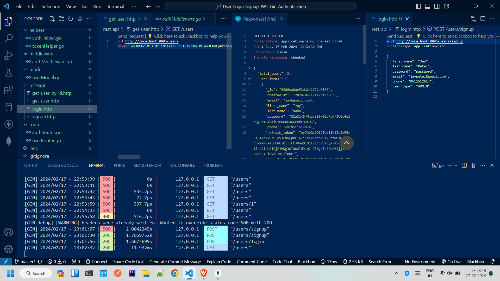
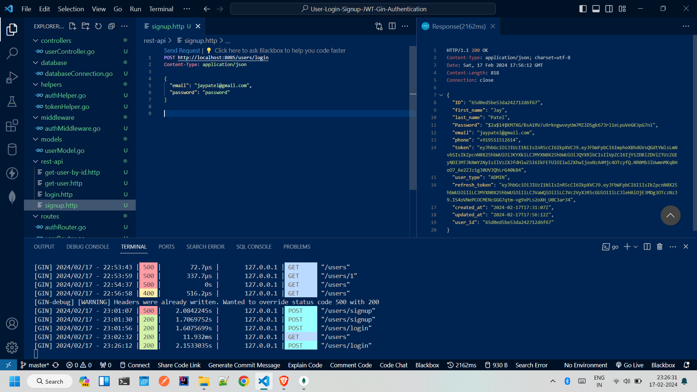
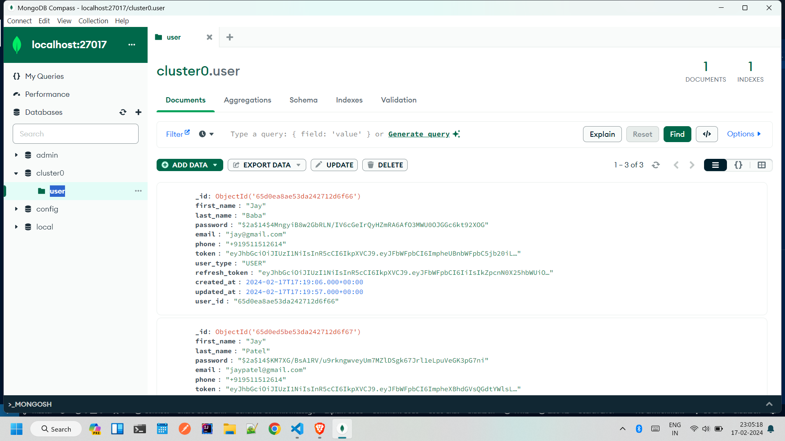

# Golang User Login-Signup with JWT Authentication

This project demonstrates user registration, login, and authentication using Golang, Gin, JWT, and MongoDB.

## API Endpoints

**User Registration**

- **POST /users/signup**
    - Creates a new user account.
    - Required fields: `first_name`, `last_name`, `password`, `email`, `phone`, `user_type` (either `ADMIN` or `USER`).

**User Login**

- **POST /users/login**
    - Authenticates a user and generates a JWT token.
    - Required fields: `email`, `password`.

**User Information**

- **GET /users**
    - Retrieves a list of all users (requires admin privileges).
- **GET /users/:user_id**
    - Retrieves information for a specific user based on their ID.

## User Model

```go
type User struct {
    ID              primitive.ObjectID `bson:"_id"`
    First_name      *string           `json:"first_name" validate:"required,min=2,max=100"`
    Last_name       *string           `json:"last_name" validate:"required,min=2,max=100"`
    Password        *string           `json:"Password" validate:"required,min=6"`
    Email           *string           `json:"email" validate:"email,required"`
    Phone           *string           `json:"phone" validate:"required"`
    Token           *string           `json:"token"`
    User_type       *string           `json:"user_type" validate:"required,eq=ADMIN|eq=USER"`
    Refresh_token   *string           `json:"refresh_token"`
    Created_at      time.Time         `json:"created_at"`
    Updated_at      time.Time         `json:"updated_at"`
    User_id         string            `json:"user_id"`
}
```
## Running the Project:
### 1. Clone the repository:
```bash
  git clone https://github.com/jaybaba8085/Golang-User-Login-Signup-JWT-Gin-Authentication-Project
```

### 2. Install dependencies:

```bash
go get -u ./...
```
### 3. Set up a MongoDB database.
### 4. Start the server:
```bash
go run main.go
```

## Testing

- Use a tool like Postman or curl to make requests to the API endpoints.
- Refer to the .http files in the project for sample request and response bodies.

## APIs AND Module Structure


## SignUP Response


## Mongo Database

